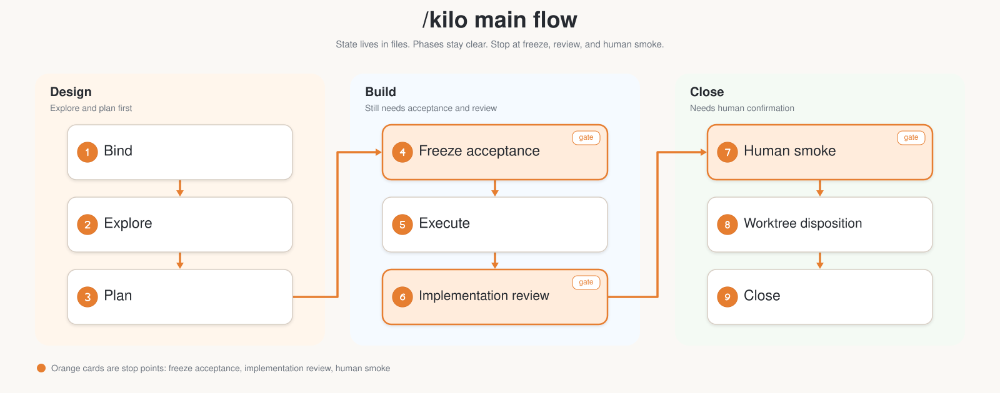
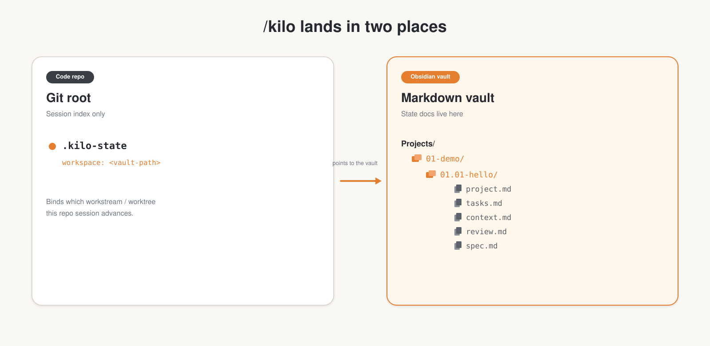

<p align="center">
  
</p>

<h1 align="center">kilo</h1>

<p align="center">
  <a href="LICENSE"></a>
  <a href="https://skills.sh/kl7sn/kilo"></a>
  <a href="#supported-agents"></a>
  <a href="#workspace"></a>
</p>

<p align="center">
  <a href="README_CN.md">中文</a>
</p>

<p align="center"><strong>Durable execution for coding agents.</strong></p>

<p align="center">
  Bind a line, keep state docs in Markdown, no <code>done</code> without evidence,<br />
  and continue from Handoff — not from old chat history.
</p>

<p align="center">
  <a href="https://skills.sh/kl7sn/kilo"><strong>Install kilo</strong></a>
  · follows
  <a href="https://agentskills.io/">Agent Skills</a>
  via
  <a href="https://skills.sh">skills.sh</a>
</p>

## What it is

`/kilo` is a process skill for Cursor, Claude Code, and Codex.

Multi-step work you can pause and resume:

```text
bind line → explore / plan / execute → verify → hand off → continue
```



State docs live in an **Obsidian Markdown vault**. The code repo only keeps a small `.kilo-state` pointer. No control plane. No SaaS.

## Why it exists

Agents write code well. They struggle with:

- **Continuity** — lose the thread across chats, tools, weekends
- **Evidence** — mark `done` with nothing to show
- **Scope** — drift off-plan or skip task rows

Full-process frameworks (GSD, BMAD, Spec-Kit, …) can help, but they often take over the process — and then process bugs are hard to fix.

`/kilo` keeps state in files, keeps phases explicit, and stops when it should instead of pushing ahead.

## What it does

- **Three layers** — project → line → tasks (`tasks.md` rows)
- **Sticky session** — once a repo is bound, stay on `/kilo`; no silent ad-hoc edits
- **Single writer** — only parent `/kilo` updates workspace; subagents may edit code (prefer worktrees)
- **Verification gate** — `doing → done` needs evidence in the execution log
- **Acceptance freeze** — lock the pass criteria before execute; later chat can't soften it
- **Implementation review** — a read-only reviewer checks code against Acceptance before human smoke
- **Separate review file** — Acceptance + rounds live in `review.md`; `context.md` only mirrors status
- **Project knowledge** — `project.md` keeps durable facts plus a gotcha *index*; details stay where you learned them
- **Integration gate** — all tasks `done` ≠ line closed; you still need human smoke + worktree disposition
- **Handoff** — resume from `## Handoff` in `context.md`, not from old chats
- **`/kilo auto`** — unattended advance; design reviews need dual-agent consensus; hard-stop conditions still stop

### Hard binding rules

- **One session ↔ one line ↔ one primary worktree** — don't advance multiple lines in one session
- **New sessions must bind first** — restore or pick a line before explore / plan / execute
- **Missing worktree = hard stop** — `worktree_status: missing` blocks code changes; don't fall back to the main checkout

## Quick start

### 1. Install

```bash
npx skills add kl7sn/kilo -g
```

That installs **`kilo`**. Common flags:

```bash
npx skills add kl7sn/kilo -g -y              # non-interactive
npx skills add kl7sn/kilo -g -a cursor       # Cursor only
npx skills add kl7sn/kilo --list             # see what's in the package
npx skills update                           # refresh later
```

### 2. Point at an Obsidian vault, then create a line

State docs go under the vault (`KILO_WORKSPACE` or `.kilo-state` `workspace:`). From a bound code repo:

```text
/kilo init demo          # project container in the vault (once)
/kilo new hello          # nested line under the project
```

`.kilo-state` lives at the **code repo** git root; `project.md` / `tasks.md` / … land in the vault.

### 3. Run

```text
/kilo                    # advance explore → plan → execute
/kilo auto               # unattended (hard stops still apply)
```

Every advancing reply ends with a blank line, then the status line, then another blank line, then `wt` alone (Markdown otherwise joins them):

```text
[/kilo · lang=en · auto=off · line=01-demo/01.01-hello · ready: write the hello example]

wt=none
```

## What's in the package

| Skill | Role |
| --- | --- |
| [`kilo`](skills/kilo/SKILL.md) | Process protocol — bind, phases, tasks, Handoff, gates |

`/kilo` is **not** a general skill toolkit. TDD, grilling, domain tools stay separate and optional.

The entrypoint `skills/kilo/SKILL.md` stays short (under 500 lines). Workspace, recovery, execution, auto, and reference details live under `skills/kilo/protocols/` and load only when needed.

## Commands

| Command | Description |
| --- | --- |
| `/kilo init` [projectId] | Create project container in the Obsidian vault |
| `/kilo new` [lineId] | Create nested line |
| `/kilo bind` | Rebind this session interactively |
| `/kilo adopt` [path] | Register an existing git worktree as this line's primary (`missing`/`none`/`pruned` only) |
| `/kilo up` | Classify this conversation into project / workspace facts or an existing skill |
| `/kilo accept` … | Draft or revise frozen Acceptance |
| `/kilo review` | Dispatch read-only implementation review |
| `/kilo lang` [en\|zh] | Show or set document language |
| `/kilo` | Advance current phase |
| `/kilo auto` | Unattended advance |

## Workspace

State lands in two places — don't mix them:

- **Code repo (git root):** only `.kilo-state` — which line / worktree this session is bound to.
- **Obsidian vault:** all state docs (`project.md` / `tasks.md` / `context.md` / `review.md`, …). `.kilo-state` `workspace:` points here.



Resolution order: `.kilo-state` → legacy `.run-state` → `KILO_WORKSPACE` → legacy `RUN_WORKSPACE` → you must set it up. No silent fallback to `~/run-workspace`.

```text
<code-repo>/.kilo-state              # session index only, at git root

<obsidian-vault>/                   # Obsidian vault = KILO_WORKSPACE
└── Projects/
    └── 01-demo/                    # project  NN-<slug>
        ├── project.md              # lines+worktrees · Stable Facts · Gotcha Index
        └── 01.01-hello/            # line  NN.MM-<slug>
            ├── line.md
            ├── tasks.md
            ├── context.md          # Handoff · Gotchas · Key Decisions · Execution Log
            ├── review.md           # Acceptance · ReviewIndex · Claims · ReviewThread
            └── spec.md             # optional input contract
```

Sample: [`examples/01-demo/`](examples/01-demo/) · Templates: [`templates/`](templates/) (`*.zh.md` for Chinese)

`.kilo-state` looks roughly like:

```yaml
workspace: /absolute/path/to/obsidian-vault/Projects/01-demo/01.01-hello
lang: en
project: 01.01-hello
repo: .
```

## Supported agents

| Agent | Install target |
| --- | --- |
| Cursor | `~/.cursor/skills/` |
| Claude Code | `~/.claude/skills/` |
| Codex | `~/.codex/skills/` |

One agent only: `npx skills add kl7sn/kilo -g -a <agent>`.

## What /kilo is not

| | |
| --- | --- |
| ❌ Hosted agent platform | ✅ Markdown workspace + skill protocol |
| ❌ Issue tracker you must live in | ✅ `tasks.md` rows you can grep |
| ❌ General skill hub / registry | ✅ Process assistant only |
| ❌ "Looks good" completion | ✅ Verification + human smoke before close |

## Optional companions

`/kilo` orchestrates; phase-discipline skills are optional:

- **Defaults:** superpowers (`brainstorming`, `writing-plans`, TDD, `verification-before-completion`)
- **Cherry-picks:** [mattpocock/skills](https://github.com/mattpocock/skills) — e.g. `grill-with-docs`, `to-tickets`, `code-review`
- **Don't** dual-run their `handoff` / `implement`, or move durable state out of the workspace

See [`skills/kilo/SKILL.md`](skills/kilo/SKILL.md) → *Companion skills*.

## Documentation

| Document | Purpose |
| --- | --- |
| [`skills/kilo/SKILL.md`](skills/kilo/SKILL.md) | Entrypoint; details in [`skills/kilo/protocols/`](skills/kilo/protocols/) |
| [`docs/design.md`](docs/design.md) | Design notes and tradeoffs |
| [`README_CN.md`](README_CN.md) | 中文说明 |

## Migration from `run`

Formerly published as **`run`** (`kl7sn/run`). Reinstall with:

```bash
npx skills add kl7sn/kilo -g
```

Session file is now **`.kilo-state`** (legacy `.run-state` is still read). Env vars are **`KILO_WORKSPACE`** / **`KILO_LANG`** (legacy `RUN_*` still read). Next successful bind/write persists `.kilo-state`.

## License

[MIT](LICENSE)
